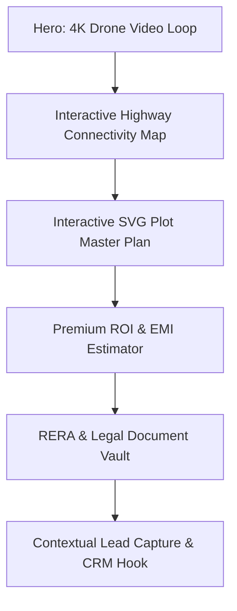

# Global Real Estate Digital Platforms: Benchmark & Market Research Report

**Author:** Senior Real Estate Market Research Analyst  
**Date:** June 28, 2026  
**Version:** 1.1  
**Target Project:** Sreeja Highway City (Sreeja Developers and Constructions)  

---

## 1. Executive Summary & Research Methodology

This report analyzes the digital experience, design language, trust mechanics, and conversion tactics of leading real estate platforms across four critical global markets: **India, Dubai (UAE), Singapore, and the United States (USA)**. 

### 1.1 Methodology & Scope
We reviewed top-tier property portals and premium developer websites in each region to extract best practices in:
*   **Aesthetics & Branding:** Hero sections, typography, color psychology, and animations.
*   **Usability & Architecture:** Navigation, layouts, and mobile-first experience.
*   **Business Drivers:** Trust building, lead generation engines, conversion rate optimization (CRO), and search engine optimization (SEO).

### 1.2 Target Benchmarks
*   **India:** Lodha Group, DLF, Housing.com
*   **Dubai:** Emaar Properties, Sobha Realty, Property Finder
*   **Singapore:** PropertyGuru, Far East Organization, ERA Singapore
*   **USA:** Zillow, Compass, Redfin

---

## 2. Regional Analysis of Leading Real Estate Platforms

### 2.1 India: Lodha Group, DLF, Housing.com
Indian real estate websites have transitioned from simple directories to trust-building digital portals, largely driven by the regulatory mandate of the Real Estate Regulation Act (RERA).

*   **Homepage & Layout:** High reliance on lifestyle imagery (happy families, luxury clubhouse interiors). The layouts are content-dense, often showing multiple project phases, award badges, and media mentions on the fold.
*   **Trust Building:** RERA registration numbers are displayed prominently. Heavy use of developer heritage stats (e.g., *"40+ years of legacy"*, *"Delivered 50,000+ homes"*).
*   **Lead Generation & Call to Action (CTA):** Highly aggressive lead capture. Quick floating buttons (WhatsApp, Call, Request Callback) are omnipresent, especially on mobile. "Schedule Site Visit with Chauffeur Pickup" is a highly converting premium CTA.
*   **Mobile Experience:** Well-optimized for mobile web, but heavily cluttered with pop-ups, chat widgets, and banner ads.

### 2.2 Dubai: Emaar Properties, Sobha Realty, Property Finder
Dubai real estate sites focus on aspirational luxury, global wealth attraction, and architectural magnificence.

*   **Hero Section & Layout:** Full-screen video loops featuring high-end drone footage of the Dubai Skyline, Marina, or premium golf courses. Layouts are spacious and dramatic with dark modes, massive font sizes, and minimal clutter.
*   **Color Psychology & Typography:** Dominated by dark colors—deep charcoal, midnight black, and metallic gold or champagne accents. Typography uses sleek geometric sans-serifs (e.g., Montserrat, Century Gothic) that evoke premium modernism.
*   **Lead Generation:** Focuses on "VIP Registration" and "Off-Plan Bookings." Instead of traditional forms, they use gated "Launch Priority Access" forms. Payment plan calculators (e.g., 60/40 payment schemes) are a core conversion driver.
*   **Trust Building:** Highlight developer creditability, master community scope, and high-yield ROI percentages (e.g., *"Up to 8% Rental Yield"*).

### 2.3 Singapore: PropertyGuru, Far East Organization, ERA
Singapore’s platforms reflect a highly organized, dense, and compliance-driven market.

*   **Homepage & Navigation:** Extremely clean, utility-focused, and search-centric. Portals like PropertyGuru prioritize search bar functionality (MRT stations, schools, district numbers).
*   **Trust Building:** Direct integrations with government zoning approvals (URA master plans) and transparent transaction history graphs.
*   **SEO & Data Integration:** Best-in-class programmatic SEO. Dynamic pages exist for every condominium project, school, and neighborhood, containing auto-generated charts of historical transaction volumes and median prices.
*   **Conversion Optimization:** Interactive financial calculators (ABSD - Additional Buyer's Stamp Duty calculators, TDSR - Total Debt Servicing Ratio calculators) are used as high-yield lead-generation magnets.

### 2.4 United States: Zillow, Compass, Redfin
USA platforms are map-centric, data-driven, and focused on agent branding and market liquidity.

*   **Homepage & Hero Section:** Very clean, white-space heavy layouts. The hero section is almost always a single, prominent search bar overlaying a high-quality local home photograph.
*   **Layout & Navigation:** Split-screen layout (Left: Interactive Map with price markers; Right: Vertical scrollable cards of property listings). Maps are highly interactive, utilizing custom vector layers (Mapbox/Google Maps).
*   **Typography & Colors:** Clean, crisp UI. Zillow uses brand blue (#006AFF) to signify security, while Compass utilizes crisp monochrome (Black and White) with editorial serif typography to convey boutique premium services.
*   **Trust Building:** Comprehensive history data (tax records, previous sales prices, price drops, school ratings, and agent reviews).

---

## 3. Comprehensive Global Benchmarking Matrix

The following matrix compares design, UX, and technical features across the studied regions:

| Feature Dimension | India (Lodha, DLF) | Dubai (Emaar, Sobha) | Singapore (PropertyGuru) | USA (Zillow, Compass) |
| :--- | :--- | :--- | :--- | :--- |
| **Hero Style** | Lifestyle slider / Project renders | Full-bleed 4K drone video loops | Map-search & filter bar | Clean Search Input over lifestyle photo |
| **Color Palette** | Bronze, Emerald Green, Navy | Charcoal Black, Matte Gold, Ivory | Red/Indigo, Clean White | Brand Blue, Slate Grey, Monochrome |
| **Primary CTA** | `[Book Site Visit]` / `[WhatsApp]` | `[Register Interest]` / `[Get VIP Invite]` | `[Enquire Now]` / `[Calculator]` | `[Take a Tour]` / `[Contact Agent]` |
| **Trust Elements** | RERA display, Delivery stats | Developer brand name, Yield percentages | Govt planning sync, Verified agent badges | Tax history, School grades, Broker reviews |
| **Lead Gen Style** | Multi-step form pop-ups | Minimalist premium registration | WhatsApp direct, Callback schedulers | Split-pane maps, Agent selection overlays |
| **Mobile Experience**| Mobile-first, but widget heavy | Highly visual, horizontal swiping | App-focused, high performance | Superb map-based mobile web wrapper |
| **SEO Strategy** | Project landing pages | International keywords, Off-plan terms | Neighborhood guides, Condo indices | Programmatic address directories |
| **Animations** | Basic fades, sliding banners | Elegant scroll triggers, GSAP transitions | Micro-interactions on buttons | High-performance map zoom/pans |

---

## 4. Key Performance Study Areas (Deep Dive)

### 4.1 Typography and Color Psychology
In premium real estate, typography and color selections dictate the perception of value before a user reads a single word.

```
Luxury Perception (Dubai/Premium India) -> Dark Mode, Serif/Geometric Sans, Gold/Charcoal
Utility & Trust Perception (USA/Singapore) -> Light Mode, Clean Sans-Serif, Navy/Blue/White
```

*   **Premium Real Estate Styling:**
    *   **The Dubai Formula (Aspirational Luxury):** Dark charcoal backgrounds (#121212) paired with thin metallic gold borders and warm beige text. This reduces eye strain, highlights bright colorful project renders, and communicates high ticket value. Font pairings: **Playfair Display (Serif)** for headings + **Inter** or **Montserrat** for copy.
    *   **The US Formula (Liquidity & Openness):** High-contrast layouts with plenty of white space. Primary color is blue (trust/corporate security) paired with slate grey for body text. Fonts: **Geograph** (Compass custom font) or **Roboto** (Zillow) which are highly legible at small sizes on mobile screens.

### 4.2 Trust Building Mechanics
For high-value plot transactions (often completed remotely or by busy professionals/NRIs), trust must be built instantly.
*   **The Digital Legal Vault:** The best sites globally do not hide legal approvals. Singapore and USA sites present historical data, zoning approvals, and taxes transparently. Premium Indian developers display RERA numbers right below project titles with links to verification portals.
*   **Visual Proof & Timelines:** Renders are no longer enough. The highest-converting platforms feature **development timelines** with chronological actual photos and video progress logs.

### 4.3 Conversion Rate Optimization (CRO)
*   **Interactive Calculators as Hook Leads:** Calculators are the most effective "soft-lead" capture tools. Instead of asking for a phone number immediately, a user inputs their plot size preference and gets an estimate. To unlock the full amortization table or tax registration breakups, they must enter their contact details.
*   **Interactive Site Plans (SVG):** Static PDF master plans result in high drop-off rates. Modern platforms use interactive vector graphics where users can tap on a plot and see its configuration. If the plot is marked as "Booked," it triggers a psychological effect of scarcity (FOMO), prompting the user to click "Get alerted on similar plots."

### 4.4 Search Engine Optimization (SEO)
*   **Programmatic Highway-Corridor SEO:** Platforms like PropertyGuru and Zillow dominate search results by programmatically generating landing pages for every conceivable combination of keywords.
    *   For a Telangana plot developer, this translates to having dedicated SEO-optimized landing pages for: `/open-plots-on-mumbai-highway`, `/hmda-plots-near-regional-ring-road`, `/residential-plots-in-shadnagar`.
*   **Structured Schema Data:** Utilizing `RealEstateListing` and `Place` JSON-LD schemas tells Google exactly what the plot size, price range, and location coordinate are, resulting in rich snippets in search engine results pages (SERPs).

---

## 5. Architectural Recommendations for Sreeja Highway City

To establish a gold-standard real estate website for Telangana’s high-growth highway corridors, we must blend Dubai’s luxury aesthetics with USA/Singapore's interactive utility, while highlighting the local brand authority of **Sreeja Developers and Constructions**.

### 5.1 Proposed Homepage Architecture



### 5.2 Mandatory Features to Implement

#### 1. Premium Dark-Mode First Hero Experience
*   **Action:** A full-bleed background video showcasing aerial drone views of Sreeja Highway City (e.g., showing traffic flowing smoothly on the highway and panning directly into the gated entrance of the property).
*   **Design:** Deep charcoal background with gold accents, using **Cinzel** for high-impact titles and **Inter** for small text.

#### 2. Vector SVG Interactive Plot Selector
*   **Action:** An interactive SVG layout plan where each plot is an individual clickable path. 
*   **Functionality:** Clicking an available plot displays a popup with plot number, facing (e.g., East facing), size (e.g., 267 Sq. Yds.), and a premium CTA button: `[Hold this Plot for 24 Hours]`.

#### 3. Chronological Project Progress Timeline
*   **Action:** A side-by-side or sliding interface comparison showing the physical growth of the plot site (road paving, boundary walls, plantation, electricity substation).
*   **Why:** Mitigates the risk of land buyers fearing that development remains static.

#### 4. The "Telangana Registration & Stamp Duty" Calculator
*   **Action:** A sliding calculator pre-programmed with Telangana government registration fee formulas (currently approx 7.5% - 9% based on rural/urban status) to estimate total layout acquisition cost.
*   **Why:** Provides high-utility value, making the website the "source of truth" for regional plot buyers.

#### 5. NRI Contextual Callback Scheduler
*   **Action:** A dedicated section or page `/nri-zone` containing GMT/EST scheduling hooks and specialized legal guidelines (e.g., NRE account guidelines, repatriation rules).

#### 6. Structured Schema Markup
*   **Action:** Integration of JSON-LD schemas for search engines to crawl pricing and location maps immediately.
```json
{
  "@context": "https://schema.org",
  "@type": "RealEstateListing",
  "name": "Sreeja Highway City Gated Plots",
  "description": "Premium highway-facing residential and commercial open plots on NH-65, developed by Sreeja Developers and Constructions",
  "offers": {
    "@type": "QuantitativeValue",
    "value": "35000",
    "unitText": "INR per Sq. Yard"
  }
}
```

---

## 6. Conclusion
By incorporating **Dubai-style luxury aesthetics** (dark backgrounds, gold highlights, video-centric headers) to drive brand authority, and **US/Singapore-style technical features** (interactive SVG sitemaps, localized ROI calculators, programmatic SEO) to drive utility, the **Sreeja Highway City** platform will maximize conversion rates and secure high-value qualified leads from local and international investors, maintaining the absolute trust (*Nammakam*) associated with **Sreeja Developers and Constructions**.
