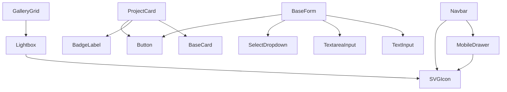

# Component Library Specification – Sreeja Developers and Constructions

**Role:** Principal Frontend Component Architect  
**Project:** Sreeja Highway City Web Platform (MVP)  
**Document:** ComponentLibrary.md  
**Status:** Approved for Implementation (Single Source of Truth)  
**Version:** 1.0  

---

## 1. Executive Summary & Component Metadata

This document defines every reusable UI component that will exist in the Sreeja Developers and Constructions V1 MVP web application. It acts as the definitive contract for component design, interactions, and props for the engineering team.

Canonical CMP identifiers and file paths are defined in [04_UI_UX/ComponentInventory.md](../04_UI_UX/ComponentInventory.md). If any local references differ, treat the inventory as the source of truth.

*   **Total Number of Components:** 43
*   **Design Pattern:** Atomic design principles mapped to Page-Feature-Component structures.
*   **Accessibility Baseline:** WCAG 2.1 Level AA.
*   **Code Policy:** No actual React/TypeScript code implementation in this file. Pure design architecture specification.

---

## 2. File Organization & Architecture

### 2.1 Recommended Directory Tree
```
src/
├── components/                # Shared stateless UI elements
│   ├── ui/                    # Base atoms
│   │   ├── Button.tsx
│   │   ├── Input.tsx
│   │   ├── Select.tsx
│   │   ├── Badge.tsx
│   │   ├── Typography.tsx
│   │   └── Card.tsx
│   │
│   ├── feedback/              # Indicators and error layouts
│   │   ├── Alert.tsx
│   │   ├── Toast.tsx
│   │   ├── Loader.tsx
│   │   ├── Skeleton.tsx
│   │   └── StateWidgets.tsx
│   │
│   └── layout/                # Page structural frames
│       ├── Container.tsx
│       ├── Grid.tsx
│       ├── Navbar.tsx
│       └── Footer.tsx
│
├── features/                  # Domain-specific components
│   ├── home/                  # Home feature modules
│   │   ├── FeaturedProjects.tsx
│   │   └── Testimonials.tsx
│   │
│   ├── about/                 # About feature modules
│   │   └── Timeline.tsx
│   │
│   └── projects/              # Projects feature modules
│       ├── ProjectCard.tsx
│       └── ProjectAmenities.tsx
```

### 2.2 Import Conventions
*   **Path Aliasing:** Use `@/` for path mapping (e.g., `import { Button } from '@/components/ui/Button'`).
*   **Barrel Exports:** Avoid barrel exports (`index.ts`) in performance-critical UI folders to optimize build performance and build sizes.
*   **Asset Imports:** Import brand assets directly using CDN URLs or relative paths (e.g., `import Logo from '@/assets/branding/logo.svg'`).

---

## 3. Naming & Documentation Standards

### 3.1 Component Naming Conventions
*   **Component Folders & Files:** Use **PascalCase** (e.g., `ProjectCard.tsx`).
*   **Sub-components:** Group sub-components using dot-notation (e.g., `<Card.Header>`, `<Card.Content>`).
*   **TypeScript interfaces:** Append `Props` to the component name (e.g., `interface ButtonProps`).

### 3.2 Documentation Standards
Every component source file must include a JSDoc block at the top outlining its ID, variants, and behavior rules:
```javascript
/**
 * @id CMP-004
 * @name Button
 * @purpose General action button supporting primary/secondary theme variants.
 * @a11y Meets WCAG AA targets, requires explicit aria-label if text is omitted.
 */
```

---

## 4. Component Hierarchy Tree

```
PageLayout (Template Layout)
├── Navbar (CMP-005)
│   ├── SVGIcon (CMP-038)
│   └── MobileDrawer (CMP-006)
│       └── SVGIcon (CMP-038)
│
├── Content Area
│   ├── Hero (CMP-003)
│   │   └── Button (CMP-004)
│   │
│   ├── ProjectList (Feature Grid)
│   │   └── ProjectCard (CMP-009)
│   │       ├── Card (CMP-023)
│   │       ├── BadgeLabel (CMP-029)
│   │       └── Button (CMP-004)
│   │
│   ├── GalleryGrid (CMP-013)
│   │   └── Lightbox (CMP-014)
│   │       └── SVGIcon (CMP-038)
│   │
│   └── BaseForm (CMP-017)
│       ├── TextInput (CMP-018)
│       ├── TextareaInput (CMP-019)
│       ├── SelectDropdown (CMP-020)
│       └── Button (CMP-004)
│
└── Footer (CMP-002)
    └── SVGIcon (CMP-038)
```

---

## 5. Dependency Diagram



---

## 6. Detailed Component Specifications

---

### GROUP 1: LAYOUT COMPONENTS

#### CMP-001: Container
*   **Purpose:** Standardize layout alignments.
*   **Description:** Center page contents and establish horizontal safe-margins.
*   **Parent Component:** PageLayout
*   **Child Components:** None
*   **Dependencies:** None
*   **Required Props:** children (ReactNode)
*   **Optional Props:** size ("sm" | "md" | "lg" | "xl" | "full")
*   **Events:** None
*   **States:** Default.
*   **Responsive Behavior:** 
    *   *Mobile:* 100% width with 16px padding.
    *   *Desktop:* Center page content with auto margins.
*   **Accessibility Requirements:** Use HTML5 semantic section tags (`<section>`) where appropriate.
*   **Animation Rules:** None.
*   **SEO Considerations:** None.
*   **Performance Notes:** Lightweight container helper with no visual styles to prevent paint delays.
*   **Acceptance Criteria:** Center layout content cleanly without creating horizontal scrollbars.
*   **Reusability Rules:** Wrap all page blocks inside this component.
*   **Future Extension Points:** Support scroll-snap properties for fullscreen slide layouts.

#### CMP-002: Grid
*   **Purpose:** Align elements to responsive layout grids.
*   **Description:** Set up responsive columns and gutters.
*   **Parent Component:** Container
*   **Child Components:** None
*   **Dependencies:** None
*   **Required Props:** children (ReactNode), cols (number | object)
*   **Optional Props:** gap (spacing token)
*   **Events:** None
*   **States:** Default.
*   **Responsive Behavior:** 
    *   *Mobile:* 1 column.
    *   *Desktop:* Up to 12 columns.
*   **Accessibility Requirements:** Ensure layout order matches tab order.
*   **Animation Rules:** None.
*   **SEO Considerations:** None.
*   **Performance Notes:** Uses browser CSS grids for high layout performance.
*   **Acceptance Criteria:** Center grids and wrap content on mobile screens.
*   **Reusability Rules:** Use for cards and image lists.
*   **Future Extension Points:** Support interactive layout changes.

#### CMP-003: Flex
*   **Purpose:** Flexbox layout container.
*   **Description:** Align items along horizontal or vertical axes.
*   **Parent Component:** None
*   **Child Components:** None
*   **Dependencies:** None
*   **Required Props:** children (ReactNode)
*   **Optional Props:** direction ("row" | "col"), align ("start" | "center" | "end"), justify ("start" | "center" | "end" | "between")
*   **Events:** None
*   **States:** Default.
*   **Responsive Behavior:** Direct flex transitions based on viewport.
*   **Accessibility Requirements:** None.
*   **Animation Rules:** None.
*   **SEO Considerations:** None.
*   **Performance Notes:** Basic helper with no state.
*   **Acceptance Criteria:** Support flex layouts.
*   **Reusability Rules:** Use for headers and button groups.
*   **Future Extension Points:** None.

#### CMP-004: Spacer
*   **Purpose:** Add vertical or horizontal space between elements.
*   **Description:** Clean layout spacing without empty text elements.
*   **Parent Component:** None
*   **Child Components:** None
*   **Dependencies:** None
*   **Required Props:** size (spacing token)
*   **Optional Props:** axis ("x" | "y")
*   **Events:** None
*   **States:** Default.
*   **Responsive Behavior:** Adapt sizes for mobile screens.
*   **Accessibility Requirements:** Mark as decorative using `aria-hidden="true"`.
*   **Animation Rules:** None.
*   **SEO Considerations:** None.
*   **Performance Notes:** Compiles to basic padding classes.
*   **Acceptance Criteria:** Render precise space separations.
*   **Reusability Rules:** Use to separate text blocks.
*   **Future Extension Points:** Support responsive spacing configurations.

---

### GROUP 2: NAVIGATION COMPONENTS

#### CMP-005: Navbar
*   **Purpose:** Manage global site navigation and logo display.
*   **Description:** Sticky header featuring navigation links, RERA disclosures, and contact buttons.
*   **Parent Component:** PageLayout
*   **Child Components:** MobileDrawer (CMP-006), Button (CMP-031)
*   **Dependencies:** useScrollPosition hook
*   **Required Props:** None
*   **Optional Props:** activePath (string)
*   **Events:** onNavigate (function)
*   **States:** Default (transparent), Scrolled (Obsidian background), Mobile Open.
*   **Responsive Behavior:** 
    *   *Mobile:* Hides links behind a hamburger menu toggle.
    *   *Desktop:* Horizontal link layout.
*   **Accessibility Requirements:** Keyboard focus outlines, aria-expanded labels.
*   **Animation Rules:** Background changes color over 200ms when scrolling.
*   **SEO Considerations:** Nav links use clean HTML anchors (`<a>`).
*   **Performance Notes:** Passive scroll listeners to avoid layout reflows.
*   **Acceptance Criteria:** Stick to the top of the viewport, change colors on scroll, and support mobile toggles.
*   **Reusability Rules:** Main site nav template.
*   **Future Extension Points:** Support interactive sub-menu lists.

#### CMP-006: MobileDrawer
*   **Purpose:** Host mobile navigation paths.
*   **Description:** Slide-in drawer covering the full screen.
*   **Parent Component:** Navbar
*   **Child Components:** Button (CMP-031)
*   **Dependencies:** Framer Motion
*   **Required Props:** isOpen (boolean), onClose (function)
*   **Optional Props:** None
*   **Events:** onClose
*   **States:** Closed (hidden), Open (sliding).
*   **Responsive Behavior:** Only visible on mobile viewports.
*   **Accessibility:** Focus lock active, close drawer with Escape key.
*   **Animation Rules:** Drawer slides in from the right over 300ms.
*   **SEO Considerations:** Uses proper semantic tags.
*   **Performance Notes:** Unmounts from DOM when closed to save memory.
*   **Acceptance Criteria:** Lock background scrolling when active, trap focus, and close on backdrop tap.
*   **Reusability Rules:** Used for mobile menus and form filters.
*   **Future Extension Points:** Support multi-level menus.

#### CMP-007: Breadcrumb
*   **Purpose:** Display site path location hierarchy.
*   **Description:** Navigation links showing current location details.
*   **Parent Component:** None
*   **Child Components:** SVGIcon (CMP-038)
*   **Required Props:** paths (array of label/url objects)
*   **States:** Default.
*   **Accessibility:** Nav container uses `aria-label="Breadcrumb"`.
*   **Responsive Behavior:** Truncate items on mobile viewports.
*   **SEO Considerations:** Render schema markup (`BreadcrumbList`).
*   **Acceptance Criteria:** Render correct paths, highlighting the current page.

#### CMP-008: Pagination
*   **Purpose:** Navigate multi-page lists.
*   **Description:** Simple indicator and buttons to move between pages.
*   **Parent Component:** None
*   **Child Components:** Button (CMP-004)
*   **Required Props:** currentPage (number), totalPages (number)
*   **Events:** onPageChange (function)
*   **States:** Active, Disabled controls.
*   **Accessibility:** Nav container uses `aria-label="Pagination"`.
*   **Responsive Behavior:** Simplify controls on mobile viewports.
*   **Acceptance Criteria:** Page change events trigger correctly.

---

### GROUP 3: PROJECT COMPONENTS

#### CMP-009: ProjectCard
*   **Purpose:** Summarize project details inside catalog listings.
*   **Description:** Display project status, location, and approval badges.
*   **Parent Component:** Grid (CMP-002)
*   **Child Components:** BaseCard (CMP-023), BadgeLabel (CMP-029), Button (CMP-004)
*   **Required Props:** project (object)
*   **States:** Default, Hover (image zoom).
*   **Responsive Behavior:** Stacks details vertically on mobile screens.
*   **Accessibility:** Card content link uses a descriptive focus title.
*   **Animation Rules:** Smooth hover zoom effects for images.
*   **SEO Considerations:** Target keywords in H3 headers.
*   **Performance Notes:** Lazy-load images, keeping aspect ratio fixed.
*   **Acceptance Criteria:** Render card, badge status, and navigate to details on click.

#### CMP-010: ProjectDetails
*   **Purpose:** Main container for project specification details.
*   **Required Props:** projectData (object)
*   **States:** Default, Loading.

#### CMP-011: ProjectAmenities
*   **Purpose:** Display amenities grid list.
*   **Required Props:** amenities (array)

#### CMP-012: ProjectConnectivity
*   **Purpose:** Display travel times and locations.
*   **Required Props:** destinations (array)

---

### GROUP 4: GALLERY COMPONENTS

#### CMP-013: GalleryGrid
*   **Purpose:** Display media files.
*   **Required Props:** mediaItems (array)
*   **Events:** onImageSelect (function)
*   **States:** Default, Loading.

#### CMP-014: Lightbox
*   **Purpose:** Fullscreen media modal.
*   **Required Props:** imageUrl (string), onClose (function)
*   **States:** Open, Closed.
*   **Accessibility:** Close modal with Escape key, trap keyboard focus.

#### CMP-015: ImageCarousel
*   **Purpose:** Slider for visual assets.
*   **Required Props:** images (array)

#### CMP-016: ChronoProgressSlider
*   **Purpose:** Show monthly development progress images.
*   **Required Props:** progressHistory (array)
*   **Events:** onDateChange (function)

---

### GROUP 5: FORMS

#### CMP-017: BaseForm
*   **Purpose:** Wrap input fields and handle submissions.
*   **Required Props:** onSubmit (function), children (node)
*   **States:** Default, Submitting, Success, Error.

#### CMP-018: TextInput
*   **Purpose:** Capture user text data.
*   **Required Props:** id (string), label (string), value (string), onChange (function)
*   **Optional Props:** placeholder (string), error (string), required (boolean)
*   **States:** Default, Active Focus, Error outline.
*   **Accessibility:** Pair inputs with visible label tags.

#### CMP-019: TextareaInput
*   **Purpose:** Capture multi-line comments.
*   **Required Props:** id (string), label (string)

#### CMP-020: SelectDropdown
*   **Purpose:** Select menu options.
*   **Required Props:** id (string), label (string), options (array), selectedValue (string), onSelect (function)

#### CMP-021: CheckboxInput
*   **Purpose:** Toggle preferences.
*   **Required Props:** id (string), label (string), checked (boolean), onChange (function)

#### CMP-022: RadioGroup
*   **Purpose:** Mutually exclusive selections.
*   **Required Props:** id (string), name (string), options (array), selectedValue (string), onChange (function)

---

### GROUP 6: CARDS

#### CMP-023: BaseCard
*   **Purpose:** Group content into clean visual containers.
*   **Required Props:** children (node)

#### CMP-024: TestimonialCard
*   **Purpose:** Display customer reviews.
*   **Required Props:** quote (string), author (string)

#### CMP-025: FAQCard
*   **Purpose:** Accordion container for FAQs.
*   **Required Props:** question (string), answer (string)

#### CMP-026: StatsCard
*   **Purpose:** Display key performance metrics.
*   **Required Props:** value (string), label (string)

---

### GROUP 7: TYPOGRAPHY

#### CMP-027: Heading
*   **Purpose:** Standard page and section headers.
*   **Required Props:** level (1 | 2 | 3 | 4 | 5 | 6), children (node)

#### CMP-028: Paragraph
*   **Purpose:** Body text formatting.
*   **Required Props:** children (node)

#### CMP-029: BadgeLabel
*   **Purpose:** Small status tags (e.g., "RERA Approved").
*   **Required Props:** label (string)

---

### GROUP 8: FEEDBACK

#### CMP-030: AlertBanner
*   **Purpose:** Display important notices.
*   **Required Props:** title (string), description (string)

#### CMP-031: ToastMessage
*   **Purpose:** Show temporary feedback alerts.
*   **Required Props:** message (string)

#### CMP-032: LoaderSpinner
*   **Purpose:** Indicate processing states.
*   **Required Props:** None.

#### CMP-033: SkeletonLoader
*   **Purpose:** Placeholders for content blocks.
*   **Required Props:** variant (string)

---

### GROUP 9: OVERLAYS

#### CMP-034: ModalDialog
*   **Purpose:** Gated popup windows.
*   **Required Props:** isOpen (boolean), onClose (function), children (node)
*   **Accessibility:** Esc closes modal, lock background scrolling.

#### CMP-035: TooltipBubble
*   **Purpose:** Display additional context on hover.
*   **Required Props:** message (string), children (node)

---

### GROUP 10: MAPS

#### CMP-036: GoogleMapSection
*   **Purpose:** Pin corporate or project locations.
*   **Required Props:** embedUrl (string)

---

### GROUP 11: UTILITIES

#### CMP-037: DynamicVideoPlayer
*   **Purpose:** Responsive background video player.
*   **Required Props:** videoUrl (string)

#### CMP-038: SVGIcon
*   **Purpose:** Vector icon helper.
*   **Required Props:** name (string)

---

### GROUP 12: SHARED COMPONENTS

#### CMP-039: FloatingWhatsApp
*   **Purpose:** Direct WhatsApp contact link.
*   **Required Props:** phoneNumber (string)

#### CMP-040: QuickCallButton
*   **Purpose:** Quick telephone dialer button.
*   **Required Props:** phoneNumber (string)

#### CMP-041: EmptyState
*   **Purpose:** Fallback display when content is empty.
*   **Required Props:** message (string)

#### CMP-042: ErrorState
*   **Purpose:** Fallback display when actions fail.
*   **Required Props:** message (string)

#### CMP-043: 404NotFound
*   **Purpose:** Default page layout for missing links.
*   **Required Props:** None.
