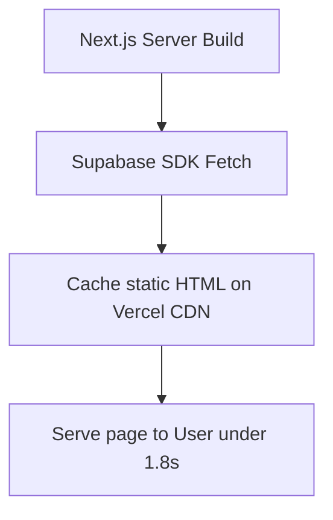

# Data Flow Specification – Sreeja Developers and Constructions

**Role:** Principal Frontend Architect  
**Project:** Sreeja Highway City MVP  
**Document:** DataFlow.md  
**Status:** Approved for Implementation  
**Version:** 1.0  

---

## 1. End-to-End Data Flow Diagram

The diagram below maps the flow of data when a user submits a site visit booking form:

```
[ User Interaction ]
       │ (Clicks submit button on form)
       ▼
[ UI Input Validation ] (Zod & React Hook Form verify inputs)
       │ (Success: lock form inputs & show loading state)
       ▼
[ Frontend Services ] (API wrapper makes POST request with fetch)
       │ (Encrypted data sent over HTTPS payload)
       ▼
[ FastAPI Backend ] (Verifies payload schema and client IP)
       │ (Encrypted connection initialized)
       ▼
[ Supabase PostgreSQL ] (Logs new lead row in database table)
       │ (Success response returned)
       ▼
[ UI State Response ] (Displays success alert & triggers WhatsApp brochure)
```

---

## 2. Dynamic Project Data Flow (Server-Side)

The flow below maps how project data is fetched and rendered on the details page:



*   **Step 1:** During build compilation, Next.js server components query Supabase to fetch active project metadata.
*   **Step 2:** The server compiles this data into static HTML pages, caching them on Vercel's edge CDN.
*   **Step 3:** When a user visits the page, the cached HTML is served instantly, ensuring fast page load speeds.
