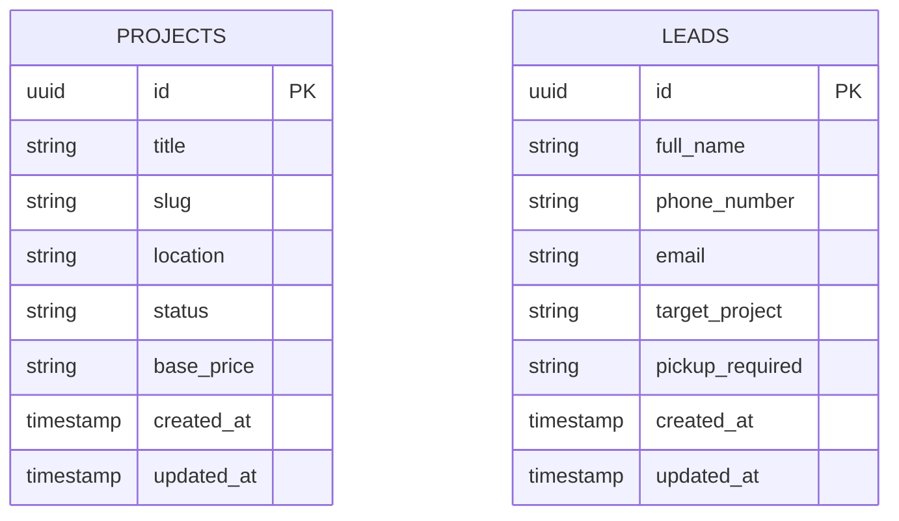

# Backend System Design & DevOps Specification

**Role:** Principal Backend Solutions Architect & DevOps Lead  
**Project:** Sreeja Highway City Web Platform (MVP)  
**Document:** BackendSystemDesign.md  
**Status:** Approved for Implementation (Single Source of Truth)  
**Version:** 1.0  

---

## 1. Backend Architecture

The backend handles form submissions, brochure downloads, data validations, database logging, and admin email alerts.

```
                    [ Client Web Browser ]
                              │
                              ▼ (API Requests via HTTPS)
                    [ FastAPI Gateway ] (Uvicorn / Docker Container)
                              │
            ┌─────────────────┴─────────────────┐
            ▼                                   ▼
      [ SQLAlchemy ]                   [ SMTP Mail Relay ]
      (PostgreSQL Connection)          (Admin Notifications)
            │
            ▼
 [ Supabase PostgreSQL DB ]
 (Leads & Project Metadata)
```

### 1.1 Folder Structure
```
backend/
├── app/
│   ├── main.py                # App entry point
│   ├── settings.py            # Environment and runtime configuration
│   │
│   ├── api/                   # API routes
│   │   ├── deps.py            # Dependency injections (DB sessions)
│   │   └── v1/
│   │       ├── leads.py       # Contact forms API
│   │       └── projects.py    # Project queries API
│   │
│   ├── db/                    # Database configurations
│   │   ├── base.py            # Base models declaration
│   │   ├── session.py         # SQLAlchemy connection setups
│   │   └── database.py        # Engine and session factory helpers
│   │
│   ├── models/                # Database schemas
│   │   ├── lead.py
│   │   └── project.py
│   │
│   ├── schemas/               # Pydantic validation schemas
│   │   ├── lead.py
│   │   └── project.py
│   │
│   └── services/              # Business logic services
│       ├── email.py           # Email alerts service
│       ├── storage.py         # Storage and asset helpers
│       ├── dependencies.py    # Reusable dependency helpers
│       └── supabase.py        # Supabase integration helpers
│
├── alembic/                   # Database migrations configuration
├── Dockerfile                 # Production environment container setup
├── requirements.txt           # Dependencies list
└── README.md
```

### 1.2 Layered Architecture & Dependency Injection
*   **Layer 1 (API Endpoints):** Receives HTTP requests, validates inputs using Pydantic schemas, and routes tasks to business logic services.
*   **Layer 2 (Business Logic Services):** Handles validation rules, coordinates notifications, and interacts with database models.
*   **Layer 3 (Database Models):** Defines PostgreSQL table structures using SQLAlchemy.
*   **Dependency Injection:** Uses FastAPI dependencies to manage database sessions, ensuring connections are closed after requests complete.

---

## 2. Database Design

The database runs on **Supabase PostgreSQL**. The schema is designed to capture lead data and store project metadata:



### 2.1 Table Schemas

#### Projects Table (`projects`)
*   `id`: `UUID`, Primary Key, Defaults to `uuid_generate_v4()`.
*   `title`: `VARCHAR(255)`, Not Null.
*   `slug`: `VARCHAR(255)`, Unique, Not Null.
*   `location`: `VARCHAR(255)`, Not Null.
*   `status`: `VARCHAR(50)`, Defaults to "Active".
*   `base_price`: `NUMERIC(12, 2)`, Optional.
*   `created_at`: `TIMESTAMP WITH TIME ZONE`, Defaults to `NOW()`.
*   `updated_at`: `TIMESTAMP WITH TIME ZONE`, Defaults to `NOW()`.

#### Leads Table (`leads`)
*   `id`: `UUID`, Primary Key, Defaults to `uuid_generate_v4()`.
*   `full_name`: `VARCHAR(255)`, Not Null.
*   `phone_number`: `VARCHAR(50)`, Not Null.
*   `email`: `VARCHAR(255)`, Optional.
*   `target_project`: `VARCHAR(255)`, Optional.
*   `pickup_required`: `BOOLEAN`, Defaults to `FALSE`.
*   `created_at`: `TIMESTAMP WITH TIME ZONE`, Defaults to `NOW()`.
*   `updated_at`: `TIMESTAMP WITH TIME ZONE`, Defaults to `NOW()`.

### 2.2 Scalability & Security
*   **Database Indexes:** Create unique indexes on `projects(slug)` and query indexes on `leads(created_at)`.
*   **Audit Fields:** Every table includes `created_at` and `updated_at` fields to track changes.

---

## 3. API Specification

All endpoints are versioned and return structured JSON responses.

### 3.1 Endpoints List

#### 1. Submit Lead
*   **Endpoint:** `POST /api/v1/leads`
*   **Request Schema:**
    *   `full_name`: String (min 3 chars, required)
    *   `phone_number`: String (required)
    *   `email`: String (optional)
    *   `target_project`: String (optional)
    *   `pickup_required`: Boolean (optional)
*   **Response Schema (Success 201 Created):**
    *   `status`: "success"
    *   `lead_id`: UUID
    *   `message`: "Lead captured successfully"
*   **Status Codes:** `201` (Created), `400` (Validation Error), `429` (Rate Limited).

#### 2. Get Project Details
*   **Endpoint:** `GET /api/v1/projects/{slug}`
*   **Response Schema (Success 200 OK):**
    *   `id`: UUID
    *   `title`: String
    *   `location`: String
    *   `status`: String
    *   `base_price`: Float
*   **Status Codes:** `200` (OK), `404` (Not Found).

---

## 4. Storage Strategy (Supabase Storage)

Static files and media assets are organized in a structured bucket hierarchy:

```
supabase-storage/
└── project-assets/
    ├── sreeja-highway-city/
    │   ├── brochures/
    │   │   └── sreeja-highway-city-brochure.pdf
    │   └── layouts/
    │       └── sreeja-highway-city-layout.pdf
    │
    └── sreeja-haritha-sandalwood-county/
        ├── brochures/
        │   └── farmland-brochure.pdf
        └── layouts/
            └── farmland-layout.pdf
```

*   **Access Policies:**
    *   *Brochures & Layouts:* Public Read access. Gated download tracking is managed on the frontend.
    *   *System Media & Logos:* Public Read access with CDN caching enabled.

---

## 5. Email & Notifications

*   **Email Engine:** SMTP Mail Relay (using SendGrid, Mailgun, or Amazon SES).
*   **Form Submissions:** Form submissions trigger email alerts to the sales team with contact details and project info.
*   **Error Retry Strategy:** Email deliveries run in background threads to avoid slowing down form responses. If a delivery fails, the mailer retries three times before logging an alert.

---

## 6. Security

*   **Input Sanitization:** Validate and sanitize form inputs using Pydantic schemas to prevent script injection.
*   **SQL Injection Prevention:** All database queries are run using SQLAlchemy's ORM, which parameterized inputs automatically.
*   **CORS Configuration:** Configure CORS origins to only allow requests from approved frontend domains.

---

## 7. Deployment & DevOps

### 7.1 Production Environment Deployment
*   **FastAPI Hosting:** Railway or Render.
*   **Supabase PostgreSQL:** Supabase platform.
*   **Frontend Web Interface:** Vercel.

### 7.2 Docker Configurations
Provide a standard production Dockerfile:
*   Use a lightweight Python base image (`python:3.11-slim`).
*   Install dependencies list.
*   Expose port `8000` and start the Uvicorn application server.

---

## 8. Monitoring & Maintenance

*   **Health Check Endpoint:** `GET /health` returns database connectivity status.
*   **Logs Configuration:** Write structured JSON log outputs to tracking services (such as Papertrail or Logtail).
*   **Database Backups:** Daily automated backups managed directly on the Supabase dashboard.
