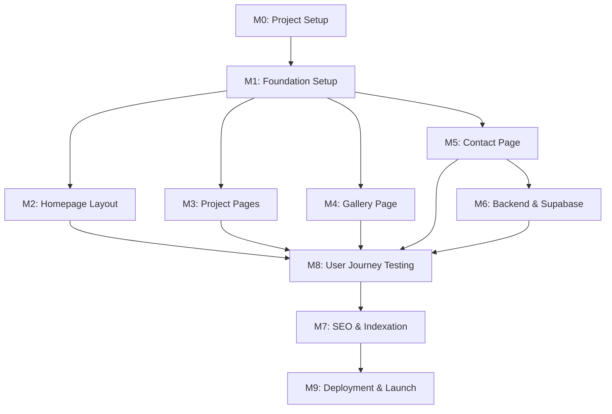

# Task Dependency Graph – Sreeja Developers and Constructions

**Role:** Engineering Manager & Scrum Master  
**Project:** Sreeja Highway City Web Platform (MVP)  
**Document:** DependencyGraph.md  
**Status:** Approved for Implementation  
**Version:** 1.0  

---

## 1. Milestone-Level Dependency Flow

The project layout follows a sequential dependency track. Visual-heavy features depend on the core layout foundation, and the final production release requires both frontend forms and backend API connections to be complete:

---

## 2. Core Task-Level Dependencies

Key task relationships are mapped below to help developers sequence their work:

*   **TSK-002 (Next.js Boilerplate)** must be complete before any other task.
*   **TSK-003 (Tailwind config)** must be configured before writing components.
*   **TSK-017 (Container Component)** is a blocker for all page layouts (TSK-031, TSK-051, TSK-071, TSK-086).
*   **TSK-020 (Navbar)** and **TSK-022 (Footer)** are required to compile the main PageLayout wrapper.
*   **TSK-086 (Site Visit Form)** must be complete on the frontend before developing TSK-102 (FastAPI handler).
*   **TSK-101 (Supabase DB)** must be deployed before configuring TSK-103 (Supabase Client Posting).
*   **TSK-126 (Journey Testing)** requires both frontend validation and backend APIs to be active.
*   **TSK-136 (Vercel Production Release)** requires the test suite to pass.
